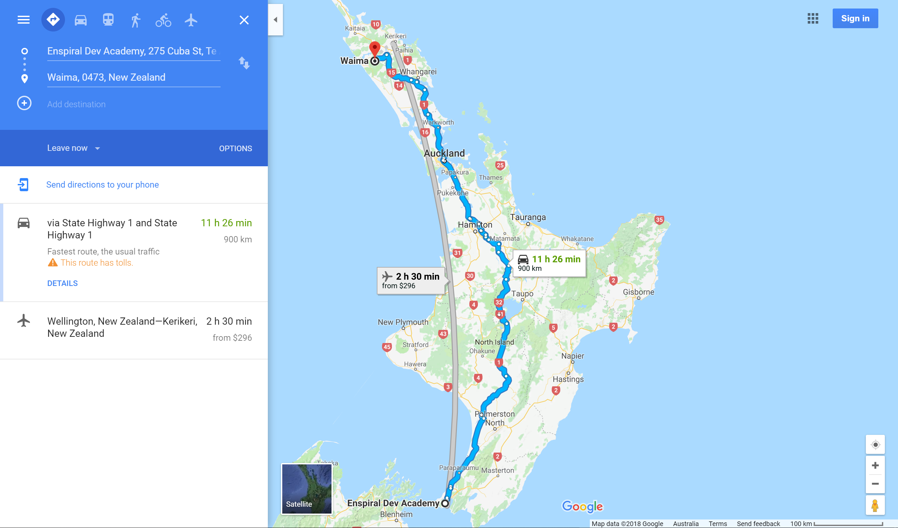
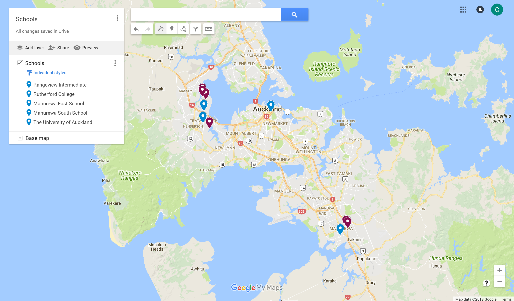

```{r setup, include=FALSE}
library(tidyverse)
knitr::opts_chunk$set(echo = FALSE)
```

# Tēnā koutou

## {.fullslide}
```{r, out.height = "700px"}

```

## {.fullslide}
```{r, out.height = "700px"}
knitr::include_graphics("images/whakatere-manawa-kaiaia.png")
```

## {.fullslide}
```{r, out.height = "700px"}
knitr::include_graphics("images/waima-river.png")
```

## {.fullslide}
```{r, out.height = "700px"}
knitr::include_graphics("images/marae.png")
```

## {.fullslide}
```{r, out.height = "700px"}

```

# Overview

## Overview

- What is Data Science?
    - Common Topics
    - Tools I use
- Intro to Machine Learning
    - Types of learning
    - Practical ML
- Getting started with Python
- Q & A

# What is Data Science?

## Data Science is:

From wikipedia:

> "Data science is an interdisciplinary field of scientific methods, processes, algorithms and systems to extract knowledge or insights from data in various forms"

Data science can cover any or all of the following:

- Data visualisation
- Statistical modelling
- Machine learning
- Automation of data-related processes
- Big data/Distributed computing

## Multidisciplinary

```{r, out.height = "500px", out.width = "500px", fig.align = "center"}
knitr::include_graphics("images/data-science-venn.png")
```

## Technical

```{r, out.height = "500px", out.width = "500px", fig.align = "center"}
knitr::include_graphics("images/data-science-venn-2.png")
```

# Tools for Data Science

## Languages

- The most popular programming languages for data science are `Python` and `R`.
- Some flavour of [`SQL`](https://www.postgresql.org/) is also often necessary
- For big data, [`Scala`](https://www.scala-lang.org/) is popular (but `Python`/`R` can do big data too)
- Learn `git`! Github is also awesome

If you want a recommendation, I'd say `Python` (but this is a matter of opinion).

```{r, out.height = "200px", fig.align = "center"}
knitr::include_graphics("images/r-vs-python.jpg")
```

## In Python

In Python, the most common tools are these:

- [`Anaconda`](https://www.anaconda.com/download/) is the python distribution I use
- [`Jupyter Notebooks`](http://jupyter.org//)/[`Jupyter Lab`](http://jupyter.org/) is the IDE I use  
- For data manipulation, I use [`pandas`](http://pandas.pydata.org/pandas-docs/version/0.15/tutorials.html)
- For machine learning, I use [`scikit-learn`](http://scikit-learn.org/stable/index.html)
- For deep learning, I use [`tensorflow`](https://www.tensorflow.org/) and [`keras`](https://keras.io/)
- For big data, I use [`pyspark`](https://spark.apache.org/docs/2.3.0/api/python/pyspark.html) 
  or increasingly [`dask`](https://dask.pydata.org/en/latest/)
- For data visualisation, I use [`matplotlib`](https://matplotlib.org/), [`seaborn`](https://seaborn.pydata.org/), 
  [`bokeh`](https://bokeh.pydata.org/en/latest/) or [`plotly`](https://plot.ly/python/)

Also noteworthy: [`scrapy`](https://scrapy.org/) for web scraping, and [`spacy`](http://spacy.io/) for natural language processing

# Machine Learning

## What is machine learning?

From wikipedia (edited):

> Machine learning is a sub-field of computer science and statistics which aims to give computers the ability to progressively improve performance on a specific task with data, without being explicitly programmed.

When it works, the idea is:

- Collect a lot of data about a problem
- Point an pattern finding algorithm at the data
- ...?
- Profit

<!-- Machine learning (or 'ML') is a quickly growing and diverse field. -->

<!-- At the cutting edge, things are changing fast, but older, popular techniques can still perform well on many problem domains. -->

## How does a machine learn?

```{r, out.width = "750px", fig.align = "center"}

```

<div class="centered">
Supervised learning
</div>

## How does a machine learn?

```{r, out.height = "400px", out.width = "650px", fig.align = "center"}

```

<div class="centered">
Unsupervised learning
</div>

## How does a machine learn?

```{r, out.width = "750px", fig.align = "center"}

```

<div class="centered">
Reinforcement learning
</div>

<!-- # Modern Machine Learning -->

<!-- ## Feature engineering -->

<!-- ```{r, out.height = "400px", out.width = "700px", fig.align = "center"} -->
<!-- knitr::include_graphics("images/deepblue.png") -->
<!-- ``` -->

<!-- <div class="centered"> --> 
<!-- Old and busted --> 
<!-- </div> --> 

<!-- ## Deep Learning -->

<!-- ```{r, out.height = "400px", out.width = "650px", fig.align = "center"} -->
<!-- knitr::include_graphics("images/alphago.png") -->
<!-- ``` -->

<!-- <div class="centered"> --> 
<!-- New hotness --> 
<!-- </div> --> 

# Supervised Learning

## Setting the problem

To get off the ground with a Machine Learning problem, you need:

- A lot of training data (i.e. examples)
- Something you want to predict (target values)
- An algorithm to predict the target values, from the example data

Machine learning works by iterating through the training, predicting the targets
via a model, and improving the model by testing its accuracy as you go along.

Train &rarr; Predict &rarr; Improve

## Classification or Regression

There are many different kinds of models, but two important classes of ML problems
are *classification* and *regression*.

```{r, out.width = "750px", fig.align = "center"}
knitr::include_graphics("images/classification-or-regression.png")
```

## Getting started

Imagine you wanted to train a classifier to distinguish apples 🍏 from oranges 🍊, based 
on the weight and texture of the fruit.

```{r}
knitr::kable(
  tribble(
    ~weight, ~texture, ~label,
    '150g', 'Bumpy', 'Orange',
    '170g', 'Bumpy', 'Orange',
    '140g', 'Smooth', 'Apple',
    '130g', 'Smooth', 'Apple',
    '...', '...', '...'
  )
)
```

## Featurisation

The first thing you have to do is find a way to encode the weight, texture and label of 
the fruit using numbers. One example of how to do this is given below:

```{r}
knitr::kable(
  tribble(
    ~weight, ~texture, ~label, ~texture_name, ~label_name,
    150, 0, 1, 'Bumpy', 'Orange',
    170, 0, 1, 'Bumpy', 'Orange',
    140, 1, 1, 'Smooth', 'Apple'
  )
)
```

</br> Question: is there another way we could have translated these into numbers?

## Decision Trees

Decision trees are a basic algorithm for doing classification. This is an example
of how to train a simple classifier using the `scikit-learn` package

```{python, eval = FALSE, echo = TRUE}
from sklearn import tree

features = [[140, 1], [130, 1], [150, 0], [170, 0]]
labels = [0, 0, 1, 1]

clf = tree.DecisionTreeClassifier()
clf = clf.fit(features, labels)

print("result is:", f.clpredict([[160, 0]]))
# result is [1]
```


